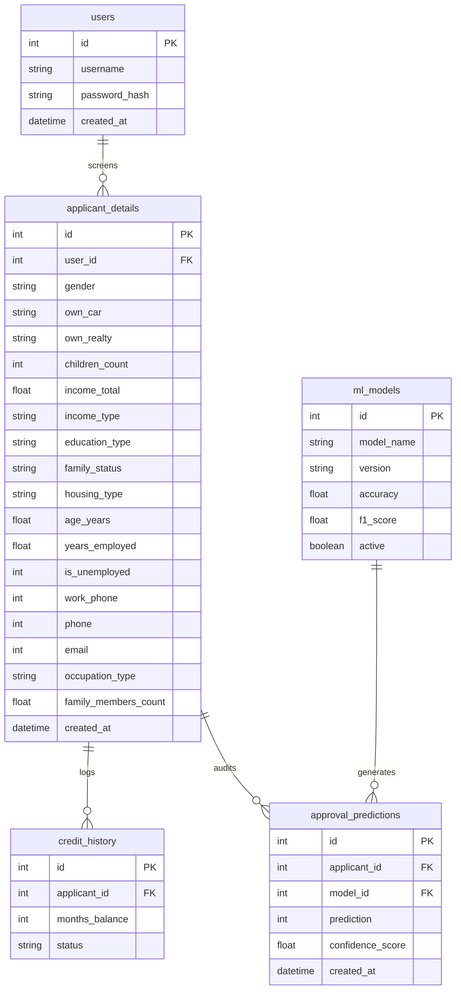

<<<<<<< HEAD
# Credit Card Approval Prediction Using Machine Learning

An end-to-end, production-grade credit risk screening system that classifies credit card applicants into **Approved (1)** or **Rejected (0)** categories based on demographic profiles, financial indicators, and historical payment histories.

---

## 1. Project Architecture

The project is developed using a clean, modular software architecture that decouples data engineering, machine learning pipelines, serialization components, and the web application interface:

```text
CreditCardApprovalPrediction/
│
├── data/
│   ├── application_record.csv       # Raw applicant demographic profiles
│   ├── credit_record.csv            # Raw monthly payment histories
│   └── final_dataset.csv            # Cleaned, merged, and engineered dataset
│
├── notebooks/
│   └── CreditCardApproval.ipynb     # Jupyter Notebook for EDA & visualizations
│
├── src/
│   ├── data_preprocessing.py        # Loading, downloading, and data cleaning routines
│   ├── feature_engineering.py       # Feature transformation, encoding, and scaling
│   ├── model_training.py            # Training routines for classifiers
│   ├── model_evaluation.py          # Metrics evaluations and ROC curves plots
│   ├── prediction.py                # Model selection and prediction facade
│   └── utils.py                     # Project utilities
│
├── saved_models/
│   ├── best_model.pkl               # Champion model (XGBoost Classifier)
│   ├── scaler.pkl                   # Fitted StandardScaler object
│   ├── encoders.pkl                 # Fitted categorical LabelEncoders map
│   └── feature_columns.pkl          # Feature columns order list
│
├── templates/
│   ├── base.html                    # Shared Jinja2 template wrapper
│   ├── home.html                    # Dashboard home page
│   ├── index.html                   # Screening submission form
│   └── result.html                  # Result visualization template
│
├── static/
│   ├── css/
│   │   └── style.css                # Custom premium UI style sheet
│   └── js/
│       └── main.js                  # Sidebar, validations, and dynamic forms script
│
├── app.py                           # Flask app & SQLAlchemy database models
├── config.py                        # Project environment configurations
├── requirements.txt                 # Project dependencies list
├── README.md                        # Documentation
└── .gitignore                       # Git ignore file
```

---

## 2. Preprocessing & Feature Engineering Pipeline

### A. Data Merging & Target Mapping
- **Merging**: Demographic profiles (`application_record.csv`) and payment histories (`credit_record.csv`) are joined on the primary key **`ID`**.
- **Target Variable Creation**: Historical payment statuses (`STATUS` column in credit record) are aggregated at the applicant level:
  - **Good Payments (STATUS = 0, X, C)**: Approved = **1** (Low default risk)
  - **Bad Payments (STATUS = 1, 2, 3, 4, 5)**: Rejected = **0** (High default risk / delinquency history)
  *If an applicant has any month flagged as delinquent (status 1–5), they are marked as Rejected (0).*

### B. Cleaning Operations
- **Deduplication**: Drop absolute duplicate profiles and duplicate `ID` rows (keeping the first occurrence).
- **Imputation**: Filled `134,193` missing cells in `OCCUPATION_TYPE` with a separate class `"Unknown"`.
- **Feature Selection**: Dropped zero-variance constant features (like `FLAG_MOBIL`).

### C. Feature Transformations
- **Age in Years (`AGE_YEARS`)**: Calculated from negative `DAYS_BIRTH` values as `abs(DAYS_BIRTH) / 365.25`.
- **Employment Status (`YEARS_EMPLOYED`, `IS_UNEMPLOYED`)**: Resolved a common dataset anomaly: a value of `365,243` days employed represents unemployment.
  - Created a binary feature flag `IS_UNEMPLOYED` (1 if unemployed, 0 if active).
  - Unemployed records get `0.0` `YEARS_EMPLOYED`, while active employees' years are calculated as `abs(DAYS_EMPLOYED) / 365.25`.

### D. Encoders & Scalers
- **Categorical Encoding**: Fitted `LabelEncoder` objects translate categorical variables (e.g. income category, education level, family status, housing arrangement) to indexed integers.
- **Numerical Scaling**: Fitted a `StandardScaler` on continuous values (`AMT_INCOME_TOTAL`, `AGE_YEARS`, `YEARS_EMPLOYED`, family sizes) to ensure scale invariance.

---

## 3. Modeling, Evaluation & Comparison

We split the merged dataset (containing `36,457` unique matched applicant profiles) into an **80-20 Train-Test Split** (`29,165` train records, `7,292` test records). Class weights were balanced during training to handle dataset skew (`Approved` = 88.37%, `Rejected` = 11.63%).

### Evaluation Metrics on Holdout Test Set:

| Classifier Model | Accuracy | Precision | Recall | F1-Score | ROC AUC |
| :--- | :---: | :---: | :---: | :---: | :---: |
| **Logistic Regression** | 55.99% | 89.82% | 56.53% | 69.39% | 55.43% |
| **Decision Tree** | 65.72% | 91.22% | 67.66% | 77.69% | 62.89% |
| **Random Forest** | 81.01% | 93.12% | 84.74% | 88.73% | **74.31%** |
| **XGBoost Classifier** | **88.29%** | 88.35% | **99.91%** | **93.77%** | 68.10% |

- **Champion Model Selection**: The script automatically selected **XGBoost Classifier** as the champion model optimizing the F1-Score (`93.77%`) and serialized it as `best_model.pkl`.
- Combined ROC curve metrics are plotted and saved in `static/images/roc_curves.png`.

---

## 4. Database Schema Design (SQLAlchemy)

The application utilizes an SQLite database (`credit_card.db`) structured according to the following Entity-Relationship schema:



---

## 5. Development Setup & Quick Start

### 1. Installation & Environment Setup
Clone the workspace and initialize a python virtual environment:
```bash
# Create virtual environment
python -m venv venv

# Activate virtual environment
# On Windows (cmd):
venv\Scripts\activate.bat
# On Windows (PowerShell):
.\venv\Scripts\Activate.ps1
# On Linux/macOS:
source venv/bin/activate

# Install requirements
pip install -r requirements.txt
```

### 2. Execute Data & ML Pipeline
Run the preprocessing, feature engineering, training, and evaluation scripts to fetch the datasets and serialize models:
```bash
# Step 1: Load and check data diagnostics
python src/data_preprocessing.py

# Step 2: Generate visual plots (EDA)
python src/eda.py

# Step 3: Run feature engineering, encoding, train-test split, and scaling
# This will save encoders.pkl and scaler.pkl
python src/feature_engineering.py

# Step 4: Run evaluations, show comparison metrics, and save ROC curve plot
python src/model_evaluation.py

# Step 5: Automatically select and serialize champion model
python src/prediction.py
```

### 3. Launch Flask Web Application
Run the local server:
```bash
# Launch server
python app.py
```
- Open your browser and navigate to: **`http://localhost:5000`**
- Use default analyst credentials to submit a test screening:
  - **Username**: `analyst`
  - **Password**: `analyst2026`
=======
# Credit-Card-Approval-Prediction_smart_bridge
>>>>>>> 3be9025f1aa6f48a05813730459fc869dbcffa22
